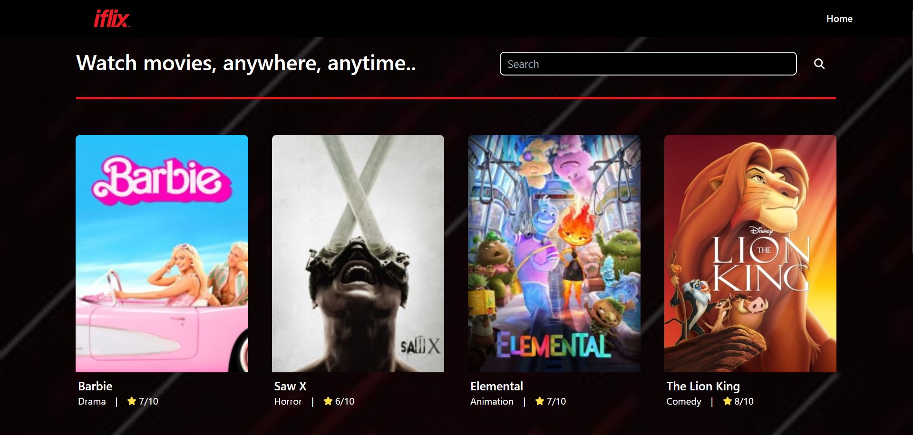
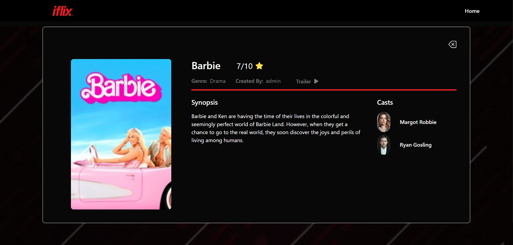
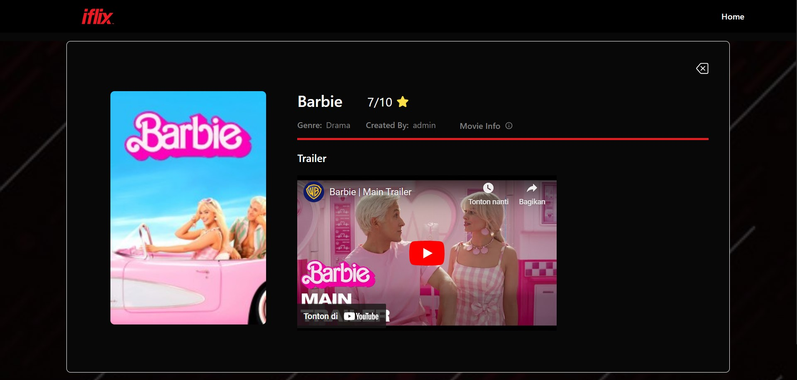
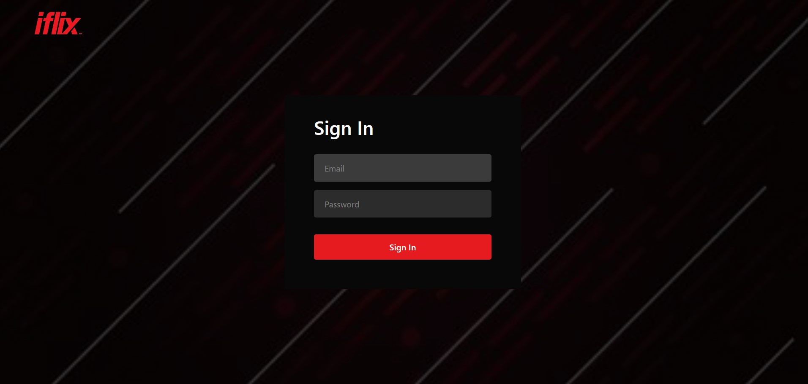
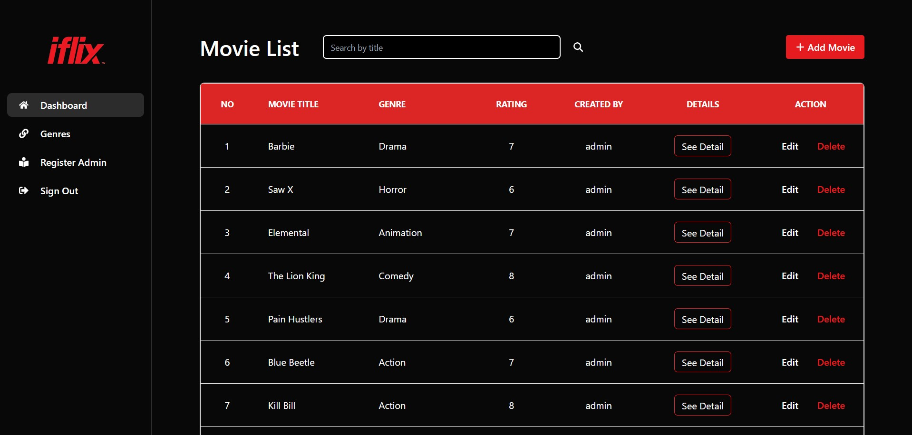
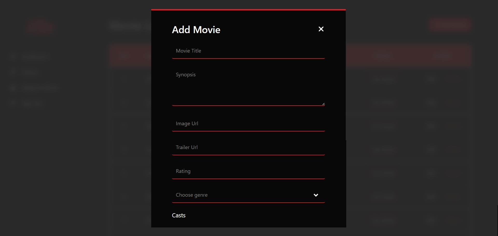

# Movies-App---Website

Consisted of two apps:

- Public facing website for user to browse Movies and see Movie Detail
- Admin facing website that has authentication and features to perform CRUD operation.
- Login info : email: admin@gmail.com, password: test123

### Tech Stack Used:

- Front-end: ReactJS, Redux, HTML,CSS, Tailwind
- Back-end: ExpressJs, Sequelize, NodeJS, PostgreSQL
- Deployment: AWS, Firebase

### Project Snippet:

#### Public-Facing Site:

#### Home page:

#### Detail page:

#### Admin-Facing site

#### Sign In:

#### Movie List:

#### Movie Form:

